# Proyecto UD3 - Hibernate

## Participantes

- Manuel Landín Gómez
- Sergio Alonso Pazo

## Supuesto textual
Se queire contruir una aplicación que permita a sus usuarios
almacenar listas con sus libros y películas favoritos. 
Para ello un usuario puede crear distintos *vaults* o almacenes donde
guardar sus listas.

* Un usuario puede iniciar sesión en la app, recuperando la configuración de su perfil y *vaults* creados.
* Un *vault* puede almacenar una lista de libros o de películas, pero no ambos.
Además un usuario podrá crear una cantidad de *vaults* arbitraria. De esta manera,
un usuario dispondá de dos listas de *vaults* independientes, una con sus
*vaults* de libros y otra con sus *vaults* de películas. 

Los datos de libros y películas serán buscados a través de la aplicación, pudiendo ser
incluidos en los vaults que el usuario desee.
Además, los datos almacenados se mostrarán al usuario,
pudiendo ser modificados, o eliminados a placer.

Toda la información estará almacenada de manera persistente en una base de datos, admitiendo
dos modalidades:
- Sistema gestor MySQL en local.
- Sistema gestor SQL Server en Azure.

La aplicación podrá ser lanzada en dos modos: CLI y GUI.

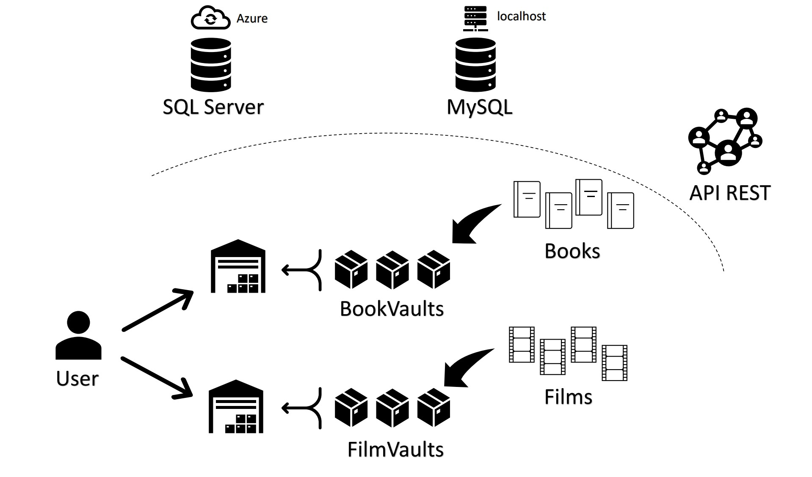

## APIs utilizadas 
### Open Library Search API
API REST aberta que proporciona datos relativos a libros publicados.

### Open Library Covers API
API REST aberta que proporciona acceso a las portadas de libros y las fotos de autor disponibles en el repositorio de portadas de la biblioteca abierta.
### The Movie Data Base (TMDB)

API REST que proporciona datos sobre películas e series.  
API key: 19ccdf01a305d5f5c3485958c90ef5d6

**Para conseguir a imaxe do póster dunha película**:  
`https://image.tmdb.org/t/p/original/<poster_path>`

#### Endpoints

- **/search/movie**
  **Formato da query**: `https://api.themoviedb.org/3/search/movie?api_key=<api_key>&query=<query>`
  Poden engadirse filtros de busca opcionais.
- **/movie/**  
  **Formato da query**: `https://api.themoviedb.org/3/movie/<movie_id>?api_key=<api_key>`
  Devolve un único obxecto `Film` segundo o _movie\_id_ empregado.

## Manual Técnico
### Documentación Java
[Javadoc](https://srgottfried.github.io/vaultApp_documentation/)
### Diagrama de clases
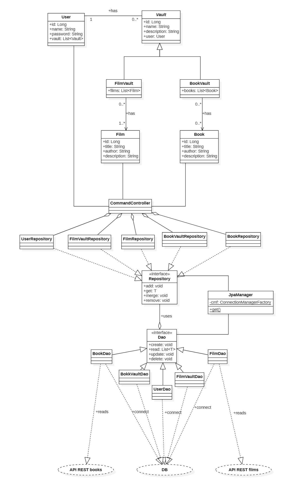
### Diagrama de persistencia
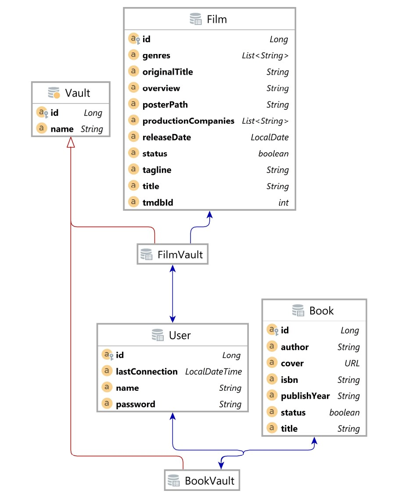

## Manual de usuario para CLI
La experiencia de usuario por interfaz de línea de comandos es una experiencia sencilla y funcional
que no debe asustar al público inexperto. En los puntos sucesivos, indicaremos el funcionamiento
básico de la aplicación, haciendo uso de la totalidad de los sencillos comandos que el usuario pueda
requerir.

#### 1. Inicio de sesión
Tan pronto como el programa se encuentre en ejecución, un prompt triangular se mostrará en la
parte izquierda del terminal. Nuestro primer paso será iniciar sesión. Para ello es suficiente
con escribir el comando `login -u USUARIO -p CONTRASEÑA` tal y como se muestra en la siguiente imagen:

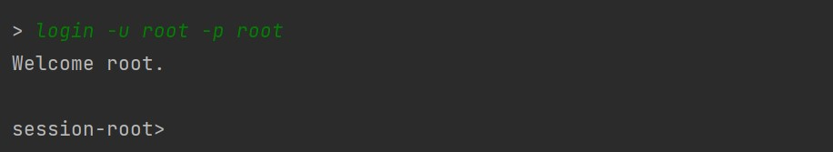

El sistema nos dará la bienvenida. El prompt se actualizará para visualizar el usuario que se encuetra
manejando la sesión.

#### 2. Status
Lo primero que podemos hacer al inicar sesión es visualizar nuestro estado de sesión a través del
comando `status`:

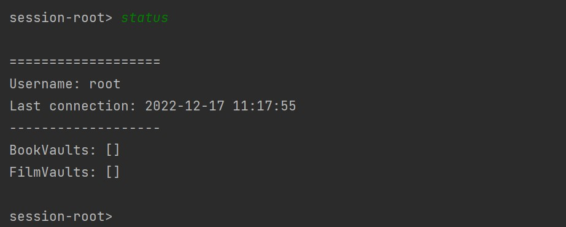

El sistema nos mostrará información sobre:
- Nuestro nombre de usuario.
- Nuestra última fecha y hora de conexión.
- Nuestras listas, tanto de libros (BookVaults) como de películas (FilmVaults).

#### 3. Crear un nuevo Vault
Esta es una aplicación de crear colecciones de libros y películas, y para ello nos apoyamos en
el concepto de **Vault**. Un **vault** es un simple contenedor, que almacenará una lista de libros
o películas. Podremos crear tantos vaults como queramos, y se almacenarán a su vez en dos listas
independientes según el tipo de vault.
BookVaults será la lista de vaults de libros, y FilmVaults la lista de vaults de películas.

Por ahora no contamos con ningún vault. Para crear un nuevo vault de libros hacemos uso del comando
`create -bv NOMBRE_DEL_VAULT` tal y como se muestra en la siguiente imagen:

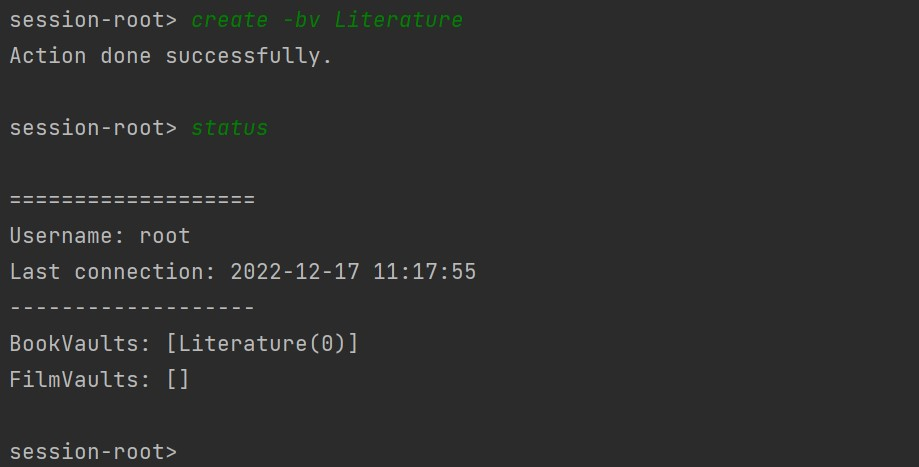

Una vez creado el vault, se mostrará en su lista correspondiente. De forma análoga podemos crear
un vault de películas a través del comando `create -fv NOMBRE_DEL_VAULT`:

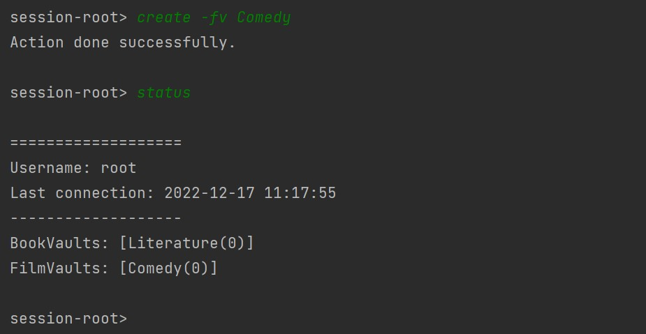

#### 4. Buscar y añadir un nuevo elemento a un vault
Como vemos en las imágenes, cada nuevo vault creado va acompañado de un número entre paréntesis.
Este número indica la cantidad de libros o películas que dicho vault tiene en su interior. Como
ambos vaults, Literature y Comedy, están recién creados, no contienen ningún elemento.

Para añadir elementos a nuestros vaults tenemos que seguir un simple proceso:
1. Hacemos uso del buscador integrado en la aplicación para encontrar el elemento deseado. Para ello
es suficiente con escribir el comando `search -b TÍTULO` para libros o `search -f TÍTULO`para 
películas. El programa nos mostrará una lista relativamente amplia de resultados obtenidos de
distintas APIs de uso libre:
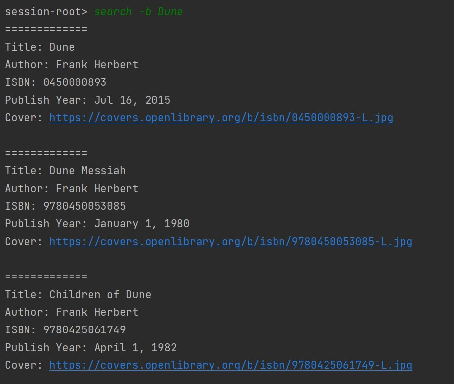
2. Una vez encontrada la versión que más nos guste, copiamos el ISBN (para libros) o TMID (para películas)
y lo usamos para añadir dicha versión a nuestro vault:
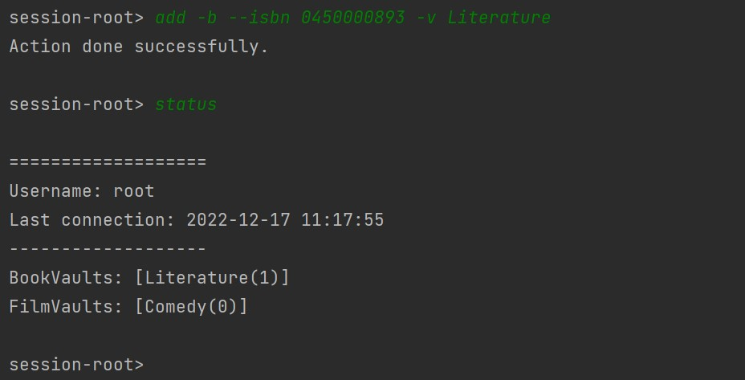
Ahora el contador del vault Literature se muestra a 1. 

Podemos repetir el
proceso de añadir libros o películas tantas veces como queramos.
En el caso de ejemplo, podemos construir una colección de libros
encapsulada en nuestro vault Literature tan grande como se desee:

#### 5. Abrir y visualizar el contenido de un vault
Para visualziar el contenido de un vault es tan sencillo como escribir
el comando `open -bv NOMBRE` para un vault de libros y 
`open -fv NOMBER` para un vault de películas.

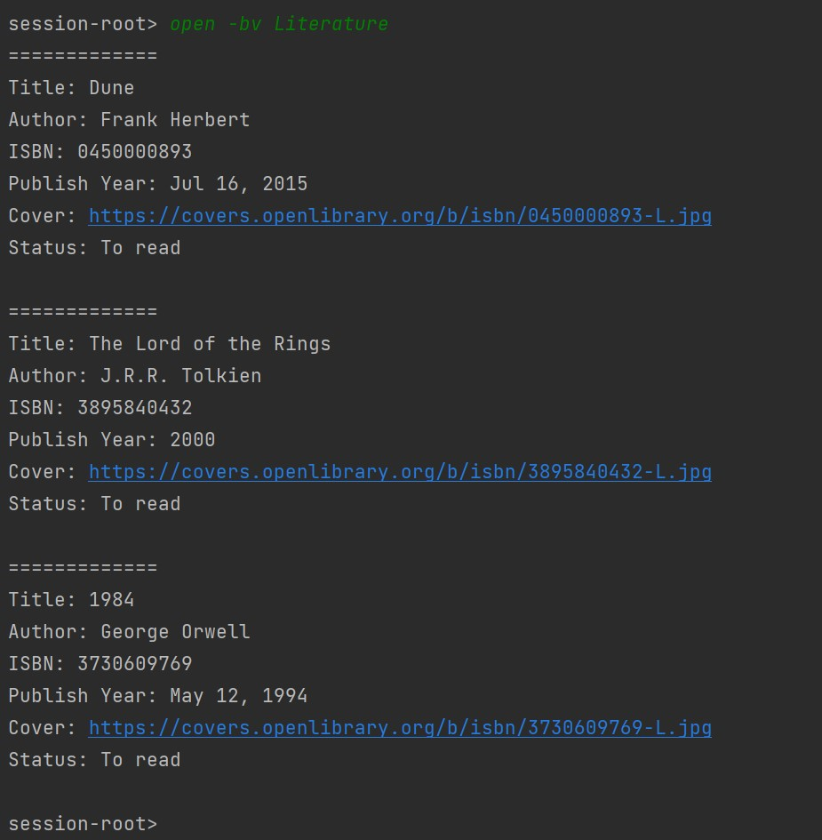

El sistema nos mostrará el contenido completo del vault, con nuestra lista de libros o películas
favoritas.

Además de la información habitual, se añade el atributo *Status* para indicar si aún no hemos
empezado a leer el libro (*to read*) o ya lo hemos terminado (*finish*). Un atributo análogo
se muestra en las listas de películas.

Para cambiar el valor de este atributo es tan sencillo como escribir el comando 
`chsts --isbn ISBN -v NOMBRE_DEL_VAULT`, tal y como se muestra en la siguiente imagen:

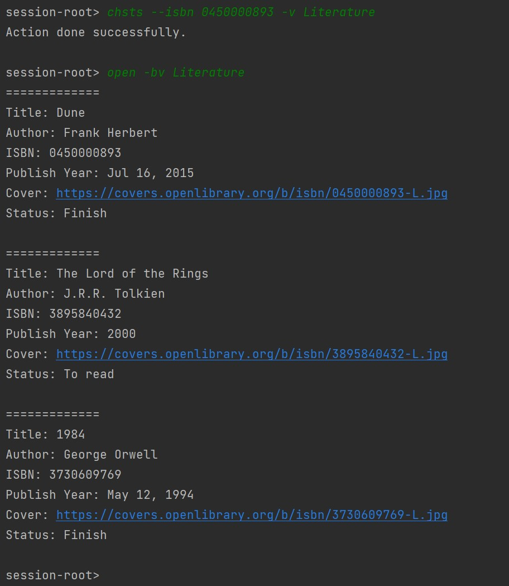

#### 6. Borrar un libro o película
Si pensamos que un libro o película ya no debiera estar en nuestra lista, podemos borrarla
del vault con el comando `delete -b --isbn ISBN -v NOMBRE_DEL_VAULT` en el caso de un libro
o `delete -f --tmid TMID -v NOMBRE_DEL_VAULT` en el caso de una película. 

En el siguiente ejemplo procedemos a borrar el libro de Dune que teníamos en nuestro
vault de libros Literature:

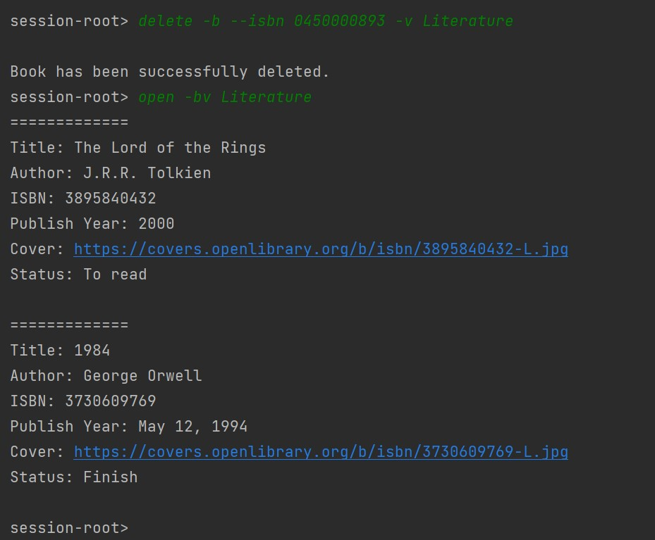

#### 7. Borrar un vault
También resulta posible borrar un vault directamente si nos hemos cansado de él.
Para ello recurrimos al comando `delete -bv NOMBRE_DEL_VAULT` para un vault de libros
o `delete -fv NOMBRE_DEL_VAULT` para un vault de películas.

En el siguiente ejemplo procedemos a borrar el vault Literature (!con libros dentro!):

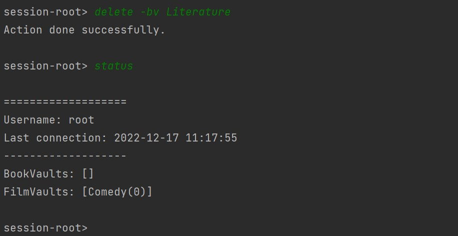

#### 8. Cerrar sesión de usuario
Para cerrar nuestra sesión y que nadie toquetee nuestros vaults favoritos, hacemos uso
del comando `logout`. El programa seguirá en ejecución, pero nuestra sesión se habrá cerrado
con éxito. 

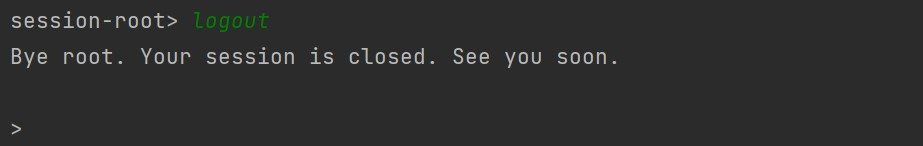

#### 9. Cerrar la aplicación
Si ningún otro usuario va a hacer uso de la aplicación en el corto plazo, podemos
parar su ejecución a través del comando `exit`:

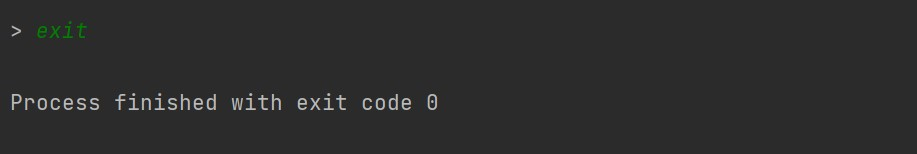

### Lista detallada de comandos para CLI
- Comandos para la gestión de la sesión:
  - `login [-u|--user] USER [-p|--password] PASSWORD` Inica sesión de usuario.
  - `logout` Cierra sesión de usuario.
  - `status` Muestra información general sobre el usuario y sus colecciones de vaults.
  - `exit` Cierra sesión y sale del programa.

- Comandos para la gestion de vaults:
  - `create [-bv|-fv|--bookvault|--filmvault] NAME` Crea un vault vacío con nombre.
  - `open [-bv|-fv|--bookvault|--filmvault] NAME` Abre y muestra un vault por nombre. El vault debe existis previamente en una colección del usuario.
  - `delete [-bv|-fv|--bookvault|--filmvault] NAME` Borra un vault por nombre. 

- Comandos para gestión de libros y películas
  - `search [-b|-f|--book|--film] NAME` Busca un libro por título en API Open Library.
  - `add [-b|--book] --isbn ISBN [-v|--vault] VAULT_NAME` Añade el libro de ISBN dado en el vault de nombre dado.
  - `add [-f|--film] --tmid TMID [-v|--vault] VAULT_NAME` Añade la película de TMID dado en el vault de nombre dado.
  - `chsts --isbn ISBN [-v|--vault] VAULT_NAME` Cambia el estado de un libro.
  - `chsts --tmid TMID [-v|--vault] VAULT_NAME` Cambia el estado de una película.
  - `delete [-b|--book] --isbn ISBN [-v|--vault] VAULT_NAME` Borra el libro de ISBN dado en el vault de nombre dado.
  - `delete [-f|--film] --tmid TMID [-v|--vault] VAULT_NAME` Borra la película de TMID dado en el vault de nombre dado.

## Manual de usuario para GUI
